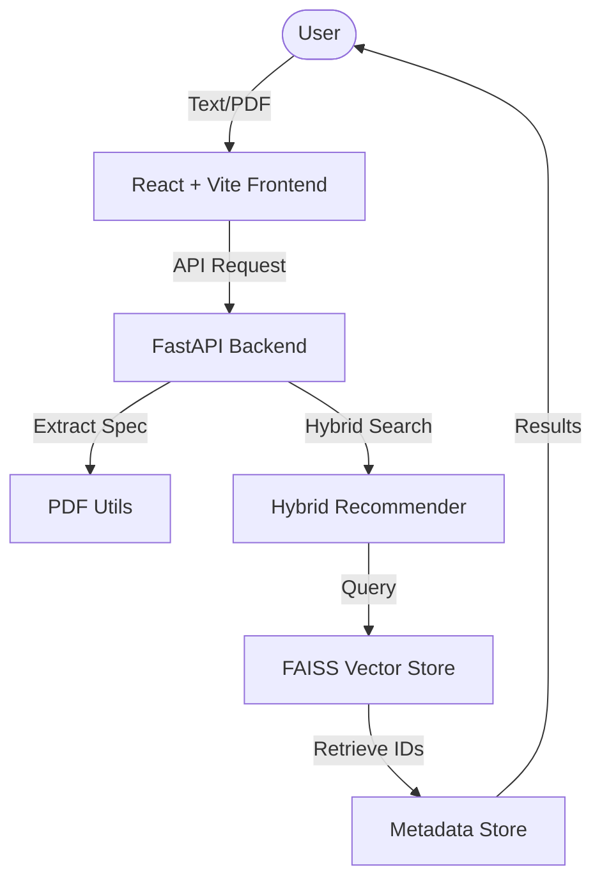

#  GitQuest AI: Smart Repository Discovery

[](https://fastapi.tiangolo.com/)
[](https://reactjs.org/)
[](https://github.com/facebookresearch/faiss)
[](https://tailwindcss.com/)

**GitQuest AI** is a professional-grade repository recommender that uses advanced hybrid embeddings to match your technical requirements with over 1,300 curated GitHub repositories. Whether you describe your project in natural language or upload a full specification PDF, GitQuest AI finds the perfect open-source foundations for your next big idea.

---

## ✨ Features

- **🧠 Hybrid AI Search**: Combines semantic intent (SentenceTransformers), technical keyword matching (TF-IDF), and repository health metrics (Stars, Forks, Recency).
- **🎨 Premium Experience**: A state-of-the-art React frontend with glassmorphism, fluid animations (Framer Motion), and a high-density dashboard.
- **📄 PDF Specification Mining**: Upload your project brief or research paper. Our system extracts key technical specs and finds matching implementations.
- **⚡ Blazing Fast**: Similarity search powered by Facebook's FAISS (Facebook AI Similarity Search) index.
- **🐳 Production Ready**: Fully containerized with Docker and Docker Compose for instant deployment.

---

## 🏗️ Architecture



---

## Getting Started

### 📦 Option 1: Docker (Recommended)
The easiest way to get GitQuest AI running is with Docker.

1. **Clone and Enter**:
   ```bash
   git clone https://github.com/ben-slimene-nour-el-houda/GitHub-Recommender-AI.git
   cd GitHub-Recommender-AI
   ```
2. **Build and Start**:
   ```bash
   docker-compose up --build
   ```
3. **Open Browser**: Go to [http://localhost:3000](http://localhost:3000)

---

### 🛠️ Option 2: Manual Installation

#### 1. Backend Setup
```bash
# Install dependencies
pip install -r requirements.txt

# Generate the Search Index (Crucial Step)
# This script processes metadata and creates the FAISS vector store
python backend/setup_data.py

# Start FastAPI
cd backend
uvicorn main:app --reload
```

#### 2. Frontend Setup
```bash
cd frontend
npm install
npm run dev
```
The UI will be available at `http://localhost:3000`.

---

## ⚙️ Configuration

You can fine-tune the recommendation algorithm by adjusting the weights in `backend/recommender.py`:

| Weight | Description | Default |
| :--- | :--- | :--- |
| `W_SEM` | **Semantic Weight**: Matches the meaning and intent of your query. | `0.6` |
| `W_TECH` | **Technical Weight**: Matches specific tools and topics. | `0.3` |
| `W_NUM` | **Numerical Weight**: Prioritizes popular and recent repos. | `0.1` |

---

## 📂 Project Structure

- `frontend/`: React source code, components, and Tailwind styles.
- `backend/`: FastAPI application logic and recommendation engine.
- `data/processed/`: Contains the repository metadata and pre-computed embeddings.
- `index/`: Stores the FAISS binary index file.
- `setup_data.py`: Utility script to rebuild the vector index and processed features.

---

## Contributing & Support
Built for the open-source community. If you find this project helpful, please give it a **⭐ Star** on GitHub!
